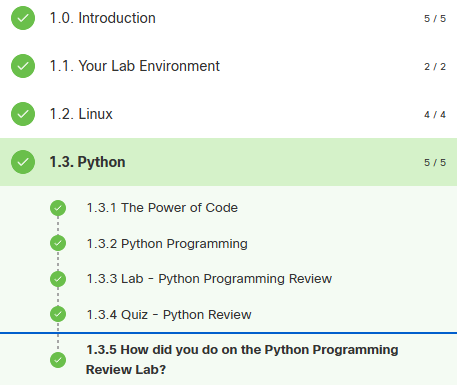
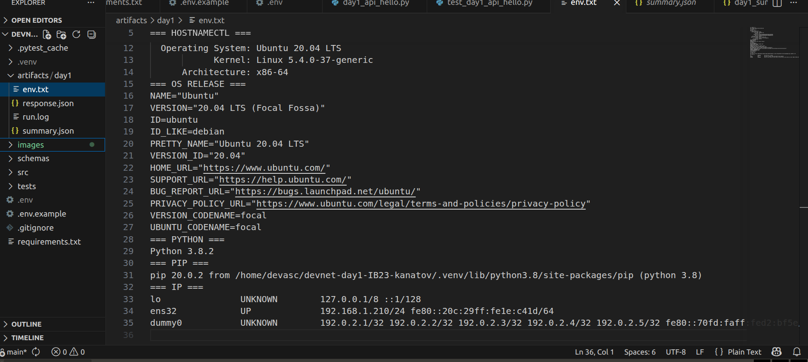
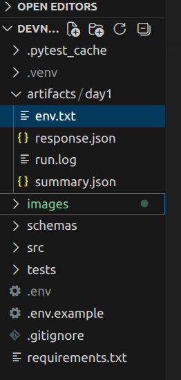
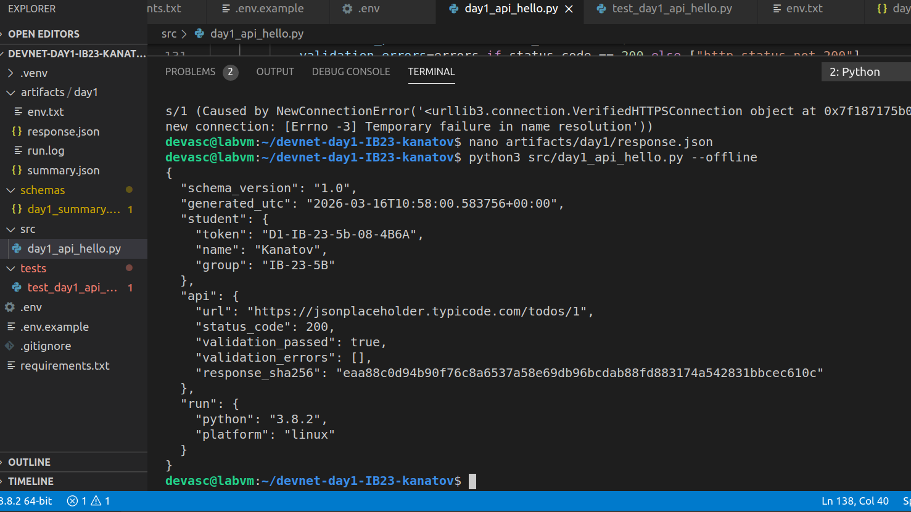
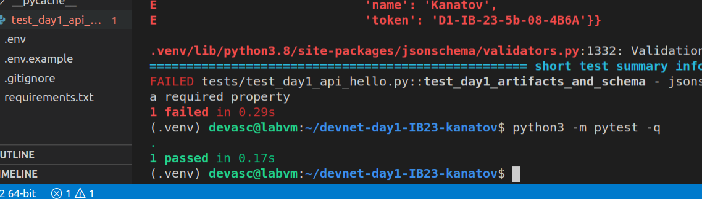

1 Student
Name: Канатов Ерхан
Group: ИБ-23-5б
GitHub repo: https://github.com/randikhan/devnet-day1-IB23-kanatov

{
  "api": {
    "response_sha256": "eaa88c0d94b90f76c8a6537a58e69db96bcdab88fd883174a542831bbcec610c",
    "status_code": 200,
    "url": "https://jsonplaceholder.typicode.com/todos/1",
    "validation_errors": [],
    "validation_passed": true
  },
  "generated_utc": "2026-03-16T11:03:22.727443+00:00",
  "run": {
    "platform": "linux",
    "python": "3.8.2"
  },
  "schema_version": "1.0",
  "student": {
    "group": "IB-23-5B",
    "name": "Kanatov",
    "token": "D1-IB-23-5b-08-4B6A"
  }
}

2 Netacad

3 VM evidence
File: artifacts/day1/env.txt exists: [Yes]
Screenshot(s):

4 Repo structure (must match assignment)
src/day1_api_hello.py : [Yes]
tests/test_day1_api_hello.py : [Yes]
schemas/day1_summary.schema.json : [Yes]
artifacts/day1/summary.json : [Yes]
artifacts/day1/response.json : [Yes]

5 Script run
{
  "api": {
    "response_sha256": "eaa88c0d94b90f76c8a6537a58e69db96bcdab88fd883174a542831bbcec610c",
    "status_code": 200,
    "url": "https://jsonplaceholder.typicode.com/todos/1",
    "validation_errors": [],
    "validation_passed": true
  },
  "generated_utc": "2026-03-16T11:03:22.727443+00:00",
  "run": {
    "platform": "linux",
    "python": "3.8.2"
  },
  "schema_version": "1.0",
  "student": {
    "group": "IB-23-5B",
    "name": "Kanatov",
    "token": "D1-IB-23-5b-08-4B6A"
  }
}

Pytest

6 Learn
Я узнал как делать HTTP-запросы к API через Python и сохранять ответ в JSON файл.
Я разобрался как создавать виртуальное окружение в Python и устанавливать нужные библиотеки через pip.

7 Problems
Из проблем я не мог войти в аккаунт гитхаб. пришлось создавать токены
